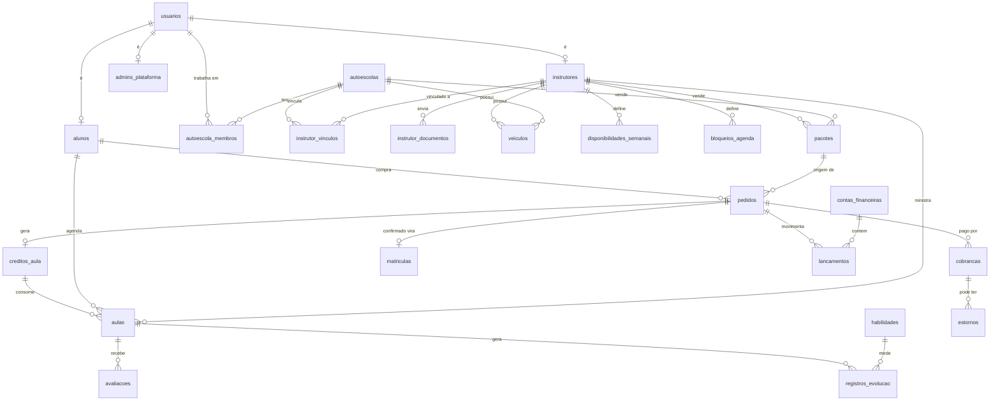

# Modelagem do banco de dados — v0.1 (para aprovação)

> Status: **aprovada e implementada nas Fases 1, 2 e 3** (veja "Ajustes feitos na implementação" abaixo). Cada tabela está marcada com a fase em que entra: **[F1]**, **[F2]**, **[F3]**, **[F4]**.
> Tabelas de fases futuras aparecem aqui para que a Fase 1 já nasça compatível com elas (sem migrações destrutivas depois).

## Ajustes feitos na implementação (Fase 1)

| Tema               | Como ficou                                                                                                                                                                                                                                                                                                                                                     |
| ------------------ | -------------------------------------------------------------------------------------------------------------------------------------------------------------------------------------------------------------------------------------------------------------------------------------------------------------------------------------------------------------- |
| RLS                | A aplicação conecta assumindo o papel `volante_app` (sem BYPASSRLS). O contexto vai em `app.ator_tipo`, `app.usuario_id`, `app.aluno_id`, `app.instrutor_id`, `app.autoescola_id`. Sem contexto, as tabelas protegidas não retornam nada. O worker usa o ator `sistema`. Tabelas de identidade (usuários, perfis) não têm RLS e são sempre filtradas pela API. |
| E-mail             | Único por `lower(email)` (sem a extensão citext).                                                                                                                                                                                                                                                                                                              |
| Código de check-in | 4 dígitos guardados em texto simples na aula; a API só o envia ao aluno. Após 5 tentativas erradas, o check-in é bloqueado.                                                                                                                                                                                                                                    |
| Status da aula     | Novo status `aguardando_confirmacao` entre o check-out do instrutor e a confirmação do aluno (ou automática em 24 h).                                                                                                                                                                                                                                          |
| Livro-razão        | Conta `externa` representa o dinheiro que entra e sai pelo gateway, para cada operação somar zero.                                                                                                                                                                                                                                                             |
| Arquivos           | Upload passa pela API (armazenamento é infraestrutura, como o banco): disco local no desenvolvimento, bucket S3 privado em produção.                                                                                                                                                                                                                           |
| Gateway            | Além de `nao_configurado` e `asaas`, existe `simulado` para testes (bloqueado em produção).                                                                                                                                                                                                                                                                    |
| Agenda             | Horários livres = jornada semanal dividida em aulas de 50 min + 10 min de intervalo, menos aulas, folgas e antecedência mínima.                                                                                                                                                                                                                                |

## Ajustes feitos na implementação (Fase 2)

| Tema                 | Como ficou                                                                                                                                                                                                                                    |
| -------------------- | --------------------------------------------------------------------------------------------------------------------------------------------------------------------------------------------------------------------------------------------- |
| Pacote de autoescola | O valor fica **retido** até a autoescola confirmar a matrícula; aí é liberado de uma vez (menos a comissão) e o saldo de aulas é desbloqueado. Recusa ou falta de resposta no prazo (`pedido.expiracao_dias`) devolvem tudo ao aluno.         |
| Pacote de instrutor  | O saldo é liberado na hora; o valor é repassado **a cada aula concluída** (proporcional, sem sobras de arredondamento na última). Aulas não usadas dentro da validade expiram e o valor retido vai ao instrutor.                              |
| Pacote não pago      | O aluno pode desistir antes de pagar; o Pix vencido cancela o pedido. Pagamento que chega depois é devolvido automaticamente.                                                                                                                 |
| Equipe da autoescola | Nova tabela `instrutor_vinculos` (convidado → ativo → encerrado). O saldo de um pacote de autoescola só pode ser usado com instrutores com vínculo ativo.                                                                                     |
| Vitrine              | Novas tabelas `autoescola_horarios` e `autoescola_fotos` (até 12), com leitura pública; `mensagem_whatsapp_padrao` aceita `{aluno}`, `{autoescola}` e `{pacote}`.                                                                             |
| Saques               | `contas_recebimento` guarda a chave Pix **cifrada** (AES-256-GCM, `CHAVE_CIFRAGEM`) e mascarada; `saques` debita o disponível na hora e o worker envia o Pix (falha definitiva devolve o valor; sem gateway fica "pendente de configuração"). |
| Chat                 | `conversas` + `mensagens` com RLS por participante; o app alerta (sem bloquear) quando a mensagem parece conter telefone.                                                                                                                     |
| Disputas e denúncias | `disputas` (por aula: estorno total, parcial ou negada, com auditoria) e `denuncias` (sigilosas). Aula com disputa aberta não é confirmada automaticamente.                                                                                   |

## Ajustes feitos na implementação (Fase 3)

| Tema                    | Como ficou                                                                                                                                                                                                                                                     |
| ----------------------- | -------------------------------------------------------------------------------------------------------------------------------------------------------------------------------------------------------------------------------------------------------------- |
| Cupons                  | `cupons` + `cupom_usos` (sem tabela `campanhas`: a campanha é um campo do cupom). Uso **reservado** na compra, **confirmado** no pagamento e **cancelado** se o pedido não for pago (o cupom volta a valer). Código em maiúsculas e único.                     |
| Quem paga o desconto    | `plataforma`: comissão = comissão sobre o bruto − desconto (pode ficar negativa: a plataforma subsidia) e o vendedor recebe o líquido de sempre. `vendedor`: comissão sobre o valor com desconto. Em ambos `líquido + comissão = total`.                       |
| Cobrança mínima         | O desconto nunca deixa o valor abaixo de R$ 5,00 (mínimo dos meios de pagamento); cada parcela do cartão também tem no mínimo R$ 5,00.                                                                                                                         |
| Cartão                  | Só para pacotes, em até `parcelas_max` vezes sem juros. O aluno paga na página do gateway (`cobrancas.url_pagamento`); nenhum dado de cartão passa pela plataforma. No Asaas, parcelado = um `installment`, estornado/cancelado como um todo.                  |
| Prazo do link do cartão | 24 h (a coluna `pix_expira_em` guarda o prazo de qualquer cobrança). Pacote não pago no prazo é cancelado.                                                                                                                                                     |
| A caminho               | Liberado a partir de 3 h antes do início. `aula_posicoes` recebe a posição do instrutor (no máximo uma a cada 5 s) de "a caminho" até o check-out; expurgada após 30 dias. Estimativa de chegada pela distância em linha reta a 25 km/h.                       |
| Contato de confiança    | `aula_compartilhamentos` guarda só o hash (SHA-256) do token; o link vale até 2 h depois do fim da aula e pode ser revogado. A página pública mostra o primeiro nome do aluno, instrutor, veículo, horário, ponto de encontro e a posição (só durante a aula). |
| Elevação pontual        | `comoSistema(tx, fn)` executa uma regra como sistema e restaura o ator (ex.: validar cupom, que o aluno não pode ler pela RLS).                                                                                                                                |

---

## 1. Convenções

| Tema            | Decisão                                                                                                                                                                                  |
| --------------- | ---------------------------------------------------------------------------------------------------------------------------------------------------------------------------------------- |
| Banco           | PostgreSQL 17 com extensões **PostGIS** (busca por raio no mapa), **btree_gist** (impedir conflito de horário na agenda), **citext** (e-mail sem diferenciar maiúsculas) e **pgcrypto**. |
| Chave primária  | `id uuid` **v7**, gerado na aplicação (ordenável no tempo, bom para índices).                                                                                                            |
| Nomes           | Português, `snake_case`, tabelas no plural.                                                                                                                                              |
| Dinheiro        | `bigint` em **centavos** (`*_centavos`). Nunca `float`.                                                                                                                                  |
| Percentuais     | Inteiro em **pontos-base** (`*_bp`): `1500` = 15,00%.                                                                                                                                    |
| Datas           | `timestamptz` para instantes. Jornada semanal usa `time` + `fuso_horario` (IANA, ex.: `America/Sao_Paulo`), pois o Brasil tem mais de um fuso.                                           |
| Status          | `text` + `CHECK`, com o mesmo enum definido em Zod em `packages/contracts` (fonte única da verdade).                                                                                     |
| Carimbos        | Toda tabela mutável tem `criado_em` e `atualizado_em` (trigger). Tabelas _append-only_ só têm `criado_em`.                                                                               |
| Dados sensíveis | Chave Pix e credenciais de integração cifradas na aplicação (AES-256-GCM) em colunas `*_cifrado bytea`.                                                                                  |
| CPF             | 11 dígitos, sem máscara, `UNIQUE`. É a chave de identificação do aluno entre sistemas.                                                                                                   |
| Exclusão (LGPD) | Exclusão de conta = **anonimização** dos dados pessoais. Registros financeiros e fiscais são mantidos pelo prazo legal, sem dados identificáveis além do necessário.                     |
| Snapshots       | Pedidos e aulas guardam cópia do preço/comissão no momento da compra. Mudar o preço depois nunca altera o que já foi vendido.                                                            |

---

## 2. Isolamento entre autoescolas (Row Level Security)

- A API conecta com o papel `app_api` (sem `BYPASSRLS`). Todas as tabelas com dados de autoescola têm `ENABLE` + `FORCE ROW LEVEL SECURITY`.
- Cada requisição roda numa transação que define o contexto com `SET LOCAL`:
  - `app.ator_tipo` → `aluno` | `instrutor` | `autoescola` | `admin` | `anonimo`
  - `app.usuario_id`, `app.aluno_id`, `app.instrutor_id`, `app.autoescola_id`
- Padrões de política (aplicados conforme as colunas de cada tabela):
  - **Autoescola**: só enxerga linhas com `autoescola_id = app.autoescola_id`.
  - **Aluno**: só enxerga linhas com `aluno_id = app.aluno_id`.
  - **Instrutor**: só enxerga linhas com `instrutor_id = app.instrutor_id`.
  - **Vitrine pública**: leitura de linhas `publicado = true` / `status = 'aprovada'` (autoescolas, pacotes, instrutores aprovados).
  - **Admin**: acesso total, sempre auditado.
- O worker usa o papel `app_worker`, que precisa processar eventos de todas as autoescolas.
- **Testes com Postgres real** criam duas autoescolas e comprovam que A não lê, não altera e não descobre por ID nada de B (pedidos, alunos, aulas, pacotes, financeiro).

---

## 3. Diagrama das relações principais



---

## 4. Tabelas por domínio

Cada domínio corresponde a um módulo NestJS em `apps/api`.

### 4.1 Identidade e acesso — módulo `identidade`

**`usuarios`** [F1] — a pessoa (um usuário pode ser aluno e instrutor ao mesmo tempo)

| coluna                 | tipo         | obs.                                                                                    |
| ---------------------- | ------------ | --------------------------------------------------------------------------------------- |
| id                     | uuid         | PK                                                                                      |
| nome                   | text         |                                                                                         |
| nome_social            | text?        |                                                                                         |
| cpf                    | char(11)?    | `UNIQUE`; obrigatório para aluno e instrutor (validado ao criar o perfil)               |
| email                  | citext       | `UNIQUE`                                                                                |
| email_verificado_em    | timestamptz? |                                                                                         |
| telefone               | text         | E.164, `UNIQUE`                                                                         |
| telefone_verificado_em | timestamptz? |                                                                                         |
| senha_hash             | text         | Argon2id                                                                                |
| data_nascimento        | date?        |                                                                                         |
| genero                 | text?        | `feminino`, `masculino`, `outro`, `prefiro_nao_informar` (usado no filtro de instrutor) |
| foto_arquivo_id        | uuid?        | FK `arquivos`                                                                           |
| status                 | text         | `ativo`, `bloqueado`, `excluido`                                                        |
| ultimo_acesso_em       | timestamptz? |                                                                                         |
| excluido_em            | timestamptz? | anonimização LGPD                                                                       |

**`admins_plataforma`** [F1] — `usuario_id` (PK, FK), `nivel` (`total`, `analista`, `financeiro`, `suporte`).

**`sessoes`** [F1] — `id`, `usuario_id`, `refresh_token_hash`, `modo_ativo` (`aluno`/`instrutor`/`autoescola`/`admin`), `autoescola_id?`, `dispositivo`, `ip`, `user_agent`, `expira_em`, `revogada_em`. Refresh token rotativo; reutilização de token revogado derruba a família de sessões.

**`codigos_verificacao`** [F1] — `id`, `usuario_id?`, `finalidade` (`verificar_telefone`, `verificar_email`, `redefinir_senha`), `canal` (`sms`, `email`), `destino`, `codigo_hash`, `tentativas`, `expira_em`, `usado_em`.

**`dispositivos_push`** [F1] — `id`, `usuario_id`, `expo_push_token` (`UNIQUE`), `plataforma` (`ios`/`android`), `ativo`, `ultimo_uso_em`.

### 4.2 LGPD e consentimentos — módulo `privacidade`

**`documentos_legais`** [F1] — `id`, `tipo` (`termos_uso`, `politica_privacidade`, `termo_instrutor`, `termo_autoescola`), `versao`, `conteudo_md`, `publicado_em`, `vigente` (bool). `UNIQUE(tipo, versao)`.

**`consentimentos`** [F1] _append-only_ — `id`, `usuario_id`, `documento_legal_id?`, `finalidade` (`termos_uso`, `politica_privacidade`, `marketing`, `compartilhar_localizacao`, `compartilhar_dados_autoescola`), `aceito` (bool), `ip`, `user_agent`, `criado_em`. Revogar = nova linha com `aceito = false`.

**`solicitacoes_exclusao`** [F1] — `id`, `usuario_id`, `status` (`solicitada`, `em_processamento`, `concluida`, `bloqueada_pendencia`), `motivo?`, `pendencias` (jsonb: aula futura, saldo a receber, disputa aberta), `solicitada_em`, `concluida_em`.

### 4.3 Arquivos — módulo `arquivos`

**`arquivos`** [F1] — `id`, `dono_usuario_id`, `bucket`, `chave_storage`, `nome_original`, `mime`, `tamanho_bytes`, `sha256`, `visibilidade` (`privado`/`publico`), `finalidade` (`selfie`, `documento`, `foto_perfil`, `foto_veiculo`, `foto_autoescola`, `logo`, `recibo`, `nota_fiscal`), `excluido_em`.

- Armazenamento compatível com S3 (MinIO no desenvolvimento). Documentos e selfies em bucket **privado**, entregues só por URL assinada de curta duração (5 min).
- Toda visualização de documento por admin ou autoescola gera registro em `auditoria`.

### 4.4 Alunos — módulo `alunos`

**`alunos`** [F1]

| coluna               | tipo  | obs.                                              |
| -------------------- | ----- | ------------------------------------------------- |
| id                   | uuid  | PK                                                |
| usuario_id           | uuid  | FK, `UNIQUE`                                      |
| categoria_desejada   | text  | `A`, `B`, `AB`, `C`, `D`, `E`, `ACC`…             |
| renach               | text? | opcional                                          |
| selfie_arquivo_id    | uuid  | FK `arquivos`                                     |
| municipio, uf        | text? | para estatísticas por cidade                      |
| horas_acumuladas_min | int   | contador desnormalizado (atualizado no check-out) |

### 4.5 Instrutores — módulo `instrutores`

**`instrutores`** [F1]

| coluna                                      | tipo                     | obs.                                                                                 |
| ------------------------------------------- | ------------------------ | ------------------------------------------------------------------------------------ |
| id                                          | uuid                     | PK                                                                                   |
| usuario_id                                  | uuid                     | FK, `UNIQUE`                                                                         |
| status                                      | text                     | `rascunho`, `em_analise`, `aprovado`, `reprovado`, `suspenso_documento`, `bloqueado` |
| motivo_status                               | text?                    | motivo de reprovação/bloqueio                                                        |
| aprovado_em / aprovado_por                  | timestamptz? / uuid?     |                                                                                      |
| bio                                         | text                     |                                                                                      |
| atua_desde                                  | smallint                 | ano (para "X anos de experiência")                                                   |
| categorias                                  | text[]                   | categorias que ensina                                                                |
| preco_aula_centavos                         | bigint                   |                                                                                      |
| duracao_aula_min                            | smallint                 | padrão 50                                                                            |
| raio_atendimento_km                         | smallint                 |                                                                                      |
| base_localizacao                            | geography(Point)         | **nunca exposta**; o mapa mostra posição aproximada (arredondada ~500 m)             |
| fornece_veiculo                             | bool                     |                                                                                      |
| aceita_veiculo_aluno                        | bool                     |                                                                                      |
| disponivel                                  | bool                     | botão disponível/indisponível                                                        |
| fuso_horario                                | text                     | IANA                                                                                 |
| antecedencia_minima_h                       | smallint                 | antecedência mínima para agendamento                                                 |
| nota_media / total_avaliacoes / total_aulas | numeric(2,1) / int / int | desnormalizados para busca                                                           |
| modo_atuacao                                | text                     | `autonomo`, `vinculado`, `ambos`                                                     |

Índices: GiST em `base_localizacao`; GIN em `categorias`; parcial `WHERE status = 'aprovado' AND disponivel`.

**`instrutor_documentos`** [F1]

| coluna                                           | tipo       | obs.                                                                                |
| ------------------------------------------------ | ---------- | ----------------------------------------------------------------------------------- |
| id                                               | uuid       |                                                                                     |
| instrutor_id                                     | uuid       | FK                                                                                  |
| tipo                                             | text       | `cnh`, `credencial_detran`, `documento_veiculo`, `comprovante_residencia`, `selfie` |
| arquivo_id                                       | uuid       | FK `arquivos` (privado)                                                             |
| numero, uf_emissor                               | text?      |                                                                                     |
| validade                                         | date?      | obrigatória para CNH, credencial e documento do veículo                             |
| status                                           | text       | `pendente`, `aprovado`, `reprovado`, `vencido`, `substituido`                       |
| analisado_por / analisado_em / motivo_reprovacao |            |                                                                                     |
| alertas_enviados                                 | smallint[] | ex.: `{30,15,7}` dias já avisados                                                   |

Rotina diária no worker: avisa com 30/15/7 dias de antecedência e, no vencimento, marca o documento como `vencido` e o instrutor como `suspenso_documento` (some da busca e não recebe novas aulas; as aulas já confirmadas geram alerta ao admin).

**`veiculos`** [F1] — `id`, `instrutor_id?`, `autoescola_id?` (exatamente um dos dois, via `CHECK`), `placa` (`UNIQUE`), `marca`, `modelo`, `ano`, `cor`, `cambio` (`manual`/`automatico`), `adaptado_pcd` (bool), `adaptacoes` (text?), `categoria`, `documento_id?` (FK `instrutor_documentos`), `foto_arquivo_id?`, `ativo`.

**`disponibilidades_semanais`** [F1] — `id`, `instrutor_id`, `dia_semana` (0–6), `hora_inicio`, `hora_fim` (`time`). `CHECK hora_fim > hora_inicio`.

**`bloqueios_agenda`** [F1] — `id`, `instrutor_id`, `periodo` (`tstzrange`), `tipo` (`bloqueio`, `ferias`), `motivo?`.

**`instrutor_vinculos`** [F2] RLS — `id`, `instrutor_id`, `autoescola_id`, `status` (`convidado`, `ativo`, `recusado`, `encerrado`), `convidado_por`, `inicio_em`, `fim_em`. `UNIQUE(instrutor_id, autoescola_id) WHERE status IN ('convidado','ativo')`.

### 4.6 Autoescolas — módulo `autoescolas` (tenant)

**`autoescolas`** [F1 cadastro e aprovação; F2 vitrine]

| coluna                                                      | tipo             | obs.                                                          |
| ----------------------------------------------------------- | ---------------- | ------------------------------------------------------------- |
| id                                                          | uuid             | PK, é o tenant                                                |
| razao_social / nome_fantasia                                | text             |                                                               |
| cnpj                                                        | char(14)         | `UNIQUE`                                                      |
| slug                                                        | text             | `UNIQUE`, para URL pública                                    |
| status                                                      | text             | `rascunho`, `em_analise`, `aprovada`, `reprovada`, `suspensa` |
| descricao                                                   | text?            |                                                               |
| telefone, whatsapp, email                                   | text             |                                                               |
| cep, logradouro, numero, complemento, bairro, municipio, uf | text             |                                                               |
| localizacao                                                 | geography(Point) |                                                               |
| logo_arquivo_id                                             | uuid?            |                                                               |
| credenciamento_detran                                       | text             | número do credenciamento                                      |
| mensagem_whatsapp_padrao                                    | text             | modelo da mensagem do botão "Chamar no WhatsApp"              |
| fuso_horario                                                | text             |                                                               |
| nota_media / total_avaliacoes                               |                  | desnormalizados                                               |

**`autoescola_membros`** [F1] RLS — `id`, `autoescola_id`, `usuario_id`, `papel` (`dono`, `gerente`, `atendente`, `financeiro`), `status` (`convidado`, `ativo`, `removido`). `UNIQUE(autoescola_id, usuario_id)`.

**`autoescola_documentos`** [F1] RLS — mesma estrutura de `instrutor_documentos`, com `tipo` (`contrato_social`, `cartao_cnpj`, `credenciamento_detran`, `alvara`).

**`autoescola_horarios`** [F2] RLS — `autoescola_id`, `dia_semana`, `abre`, `fecha`.

**`autoescola_fotos`** [F2] RLS — `id`, `autoescola_id`, `arquivo_id`, `ordem`, `legenda?`.

### 4.7 Catálogo — módulo `catalogo`

**`pacotes`** [F2] RLS (mista)

| coluna                       | tipo         | obs.                                |
| ---------------------------- | ------------ | ----------------------------------- |
| id                           | uuid         |                                     |
| vendedor_tipo                | text         | `instrutor` / `autoescola`          |
| instrutor_id / autoescola_id | uuid?        | exatamente um preenchido (`CHECK`)  |
| nome                         | text         | ex.: "10 aulas categoria B"         |
| descricao                    | text?        |                                     |
| categorias                   | text[]       | ex.: `{A,B}` para "Pacote A+B"      |
| quantidade_aulas             | smallint     |                                     |
| duracao_aula_min             | smallint     |                                     |
| preco_centavos               | bigint       |                                     |
| parcelas_max                 | smallint     | cartão parcelado [F3]               |
| validade_dias                | smallint?    | prazo para usar o saldo             |
| publicado                    | bool         |                                     |
| arquivado_em                 | timestamptz? | pacotes vendidos nunca são apagados |

Alterações de preço vão para `auditoria`.

### 4.8 Pedidos, matrículas e saldo de aulas — módulo `pedidos`

**`pedidos`** [F1 para aula avulsa; F2 para pacotes] RLS (mista) — toda compra é um pedido.

| coluna                                                                | tipo         | obs.                                                                           |
| --------------------------------------------------------------------- | ------------ | ------------------------------------------------------------------------------ |
| id                                                                    | uuid         |                                                                                |
| codigo                                                                | text         | curto e legível (ex.: `PD-7K3Q9X`), `UNIQUE`                                   |
| aluno_id                                                              | uuid         | FK                                                                             |
| vendedor_tipo                                                         | text         | `instrutor` / `autoescola`                                                     |
| instrutor_id / autoescola_id                                          | uuid?        |                                                                                |
| tipo                                                                  | text         | `aula_avulsa`, `pacote`                                                        |
| pacote_id                                                             | uuid?        | FK                                                                             |
| snapshot                                                              | jsonb        | nome, categorias, quantidade, duração e preço no momento da compra             |
| quantidade_aulas                                                      | smallint     |                                                                                |
| valor_bruto_centavos                                                  | bigint       |                                                                                |
| desconto_centavos                                                     | bigint       | cupom [F3]                                                                     |
| valor_total_centavos                                                  | bigint       | o que o aluno paga                                                             |
| comissao_bp / comissao_centavos                                       | int / bigint | snapshot da regra vigente                                                      |
| regra_comissao_id                                                     | uuid         | FK `regras_comissao`                                                           |
| valor_liquido_vendedor_centavos                                       | bigint       |                                                                                |
| status                                                                | text         | ver §5.2                                                                       |
| status_atendimento                                                    | text?        | só para autoescola: `novo`, `em_contato`, `confirmado`, `recusado`, `expirado` |
| motivo_recusa                                                         | text?        | obrigatório quando recusado                                                    |
| pago_em, primeiro_contato_em, confirmado_em, recusado_em, expirado_em | timestamptz? |                                                                                |
| lembrete_enviado_em                                                   | timestamptz? | lembrete de 48 h                                                               |
| prazo_resposta_em                                                     | timestamptz? | `pago_em + 5 dias` (configurável)                                              |
| cupom_id                                                              | uuid?        | [F3]                                                                           |

Índice da fila: `(autoescola_id, status_atendimento, pago_em) WHERE status = 'pago'`.

**`pedido_historico`** [F1] _append-only_ RLS — `id`, `pedido_id`, `autoescola_id?`, `de_status`, `para_status`, `ator_usuario_id?` (nulo = sistema), `motivo?`, `criado_em`. Alimenta a linha do tempo na tela.

**`matriculas`** [F2] RLS — `id`, `autoescola_id`, `aluno_id`, `pedido_id` (`UNIQUE`), `categorias`, `status` (`ativa`, `concluida`, `cancelada`), `criada_em`. Criada quando a autoescola confirma o pedido. É o "aluno da autoescola" e o registro que será casado com a matrícula no CFC Plus.

**`creditos_aula`** [F1] RLS (mista) — saldo de aulas de um pedido.

| coluna                                  | tipo         | obs.                                                                                       |
| --------------------------------------- | ------------ | ------------------------------------------------------------------------------------------ |
| id                                      | uuid         |                                                                                            |
| pedido_id                               | uuid         | `UNIQUE`                                                                                   |
| aluno_id, instrutor_id?, autoescola_id? | uuid         |                                                                                            |
| categorias                              | text[]       |                                                                                            |
| duracao_aula_min                        | smallint     |                                                                                            |
| quantidade_total                        | smallint     |                                                                                            |
| quantidade_reservada                    | smallint     | aulas agendadas e ainda não concluídas                                                     |
| quantidade_consumida                    | smallint     |                                                                                            |
| status                                  | text         | `bloqueado` (autoescola ainda não confirmou), `ativo`, `esgotado`, `expirado`, `estornado` |
| valido_ate                              | timestamptz? |                                                                                            |

`CHECK (quantidade_reservada + quantidade_consumida <= quantidade_total)`. Toda alteração com `SELECT … FOR UPDATE` na mesma transação da aula.

**`creditos_movimentos`** [F1] _append-only_ — `id`, `credito_id`, `aula_id?`, `tipo` (`reserva`, `consumo`, `devolucao`, `estorno`, `expiracao`), `quantidade`, `criado_em`.

### 4.9 Agenda e aulas — módulo `aulas`

**`aulas`** [F1] RLS (mista)

| coluna                                             | tipo                | obs.                                                                                   |
| -------------------------------------------------- | ------------------- | -------------------------------------------------------------------------------------- |
| id                                                 | uuid                |                                                                                        |
| aluno_id, instrutor_id                             | uuid                |                                                                                        |
| autoescola_id                                      | uuid?               | nulo = instrutor autônomo                                                              |
| pedido_id                                          | uuid                | origem do pagamento                                                                    |
| credito_id                                         | uuid                | saldo consumido (aula avulsa também gera um crédito de 1 aula, para o fluxo ser único) |
| veiculo_id                                         | uuid?               |                                                                                        |
| categoria                                          | text                |                                                                                        |
| inicio, fim                                        | timestamptz         |                                                                                        |
| periodo                                            | tstzrange           | coluna gerada `[inicio, fim)`                                                          |
| ponto_encontro                                     | geography(Point)    |                                                                                        |
| ponto_encontro_endereco / referencia               | text                |                                                                                        |
| status                                             | text                | ver §5.1                                                                               |
| aceite_ate                                         | timestamptz         | prazo para o instrutor aceitar                                                         |
| codigo_checkin                                     | char(4)             | código que o aluno mostra ao instrutor (só o aluno recebe pela API)                    |
| checkin_em / checkin_local / checkin_distancia_m   |                     | geolocalização do check-in                                                             |
| checkout_em / checkout_local                       |                     |                                                                                        |
| checkout_confirmado_em / checkout_confirmado_por   | timestamptz? / text | `aluno` ou `automatico` (sem contestação em 24 h)                                      |
| cancelada_em / cancelada_por / motivo_cancelamento |                     |                                                                                        |
| multa_cancelamento_centavos                        | bigint              | regra de X horas (snapshot)                                                            |
| politica_cancelamento                              | jsonb               | snapshot da regra no momento do agendamento                                            |
| remarcada_de_id                                    | uuid?               | FK para a aula original                                                                |

**Restrições que impedem conflito de agenda (testadas com Postgres real):**

```sql
EXCLUDE USING gist (instrutor_id WITH =, periodo WITH &&)
  WHERE (status IN ('aguardando_pagamento','solicitada','confirmada','a_caminho','em_andamento'));
EXCLUDE USING gist (aluno_id WITH =, periodo WITH &&)
  WHERE (status IN ('aguardando_pagamento','solicitada','confirmada','a_caminho','em_andamento'));
```

Mesmo com duas requisições simultâneas para o mesmo horário, o banco aceita só uma.

**`aula_historico`** [F1] _append-only_ — `id`, `aula_id`, `de_status`, `para_status`, `ator_usuario_id?`, `local?` (geography), `motivo?`, `criado_em`.

**`habilidades`** [F1] — `id`, `codigo` (`baliza`, `rampa`, `transito`, `troca_marchas`, `conversao`, `estacionamento`, `direcao_defensiva`, `sinalizacao`, `equilibrio_moto`…), `nome`, `categorias` (text[]), `ordem`, `ativa`.

**`registros_evolucao`** [F1] — `id`, `aula_id`, `aluno_id`, `instrutor_id`, `habilidade_id`, `nivel` (1–5), `observacao?`, `criado_em`. `UNIQUE(aula_id, habilidade_id)`.

**`aula_anotacoes`** [F1] — `aula_id` (PK), `instrutor_id`, `texto`, `visivel_aluno` (bool).

**`avaliacoes`** [F1 aluno→instrutor; F2 aluno→autoescola]

| coluna                       | tipo     | obs.                                           |
| ---------------------------- | -------- | ---------------------------------------------- |
| id                           | uuid     |                                                |
| aula_id / pedido_id          | uuid?    | origem (só quem teve aula/pedido pode avaliar) |
| autor_aluno_id               | uuid     |                                                |
| alvo_tipo                    | text     | `instrutor` / `autoescola`                     |
| instrutor_id / autoescola_id | uuid?    |                                                |
| nota                         | smallint | 1–5                                            |
| comentario                   | text?    |                                                |
| status                       | text     | `publicada`, `oculta` (moderação)              |
| resposta / respondida_em     | text?    | resposta do avaliado [F2]                      |

`UNIQUE(aula_id, alvo_tipo)`.

**`aula_compartilhamentos`** [F3] — `id`, `aula_id`, `token_hash`, `contato_nome`, `expira_em`, `revogado_em`. Link público temporário para contato de confiança.

**`aula_posicoes`** [F3] — `aula_id`, `instrutor_id`, `posicao` (geography), `registrado_em`. Gravado **somente** entre "a caminho" e o check-out; expurgado após 30 dias.

### 4.10 Pagamentos e financeiro — módulo `pagamentos` e `financeiro`

**`regras_comissao`** [F1] _versionada_ — `id`, `vendedor_tipo` (`instrutor`/`autoescola`), `produto_tipo` (`aula_avulsa`/`pacote`), `instrutor_id?`, `autoescola_id?` (exceção para um parceiro específico), `percentual_bp`, `valor_fixo_centavos`, `vigente_desde`, `vigente_ate?`, `criado_por`. Nunca é editada: mudar a comissão encerra a vigência da regra atual e cria outra (com registro em `auditoria`).

**`cobrancas`** [F1]

| coluna                                             | tipo         | obs.                                                 |
| -------------------------------------------------- | ------------ | ---------------------------------------------------- |
| id                                                 | uuid         |                                                      |
| pedido_id                                          | uuid         | FK                                                   |
| gateway                                            | text         | `asaas`, `pagarme`, `mercadopago`, `nao_configurado` |
| gateway_cobranca_id                                | text?        | `UNIQUE(gateway, gateway_cobranca_id)`               |
| metodo                                             | text         | `pix`, `cartao` [F3]                                 |
| parcelas                                           | smallint     |                                                      |
| valor_centavos                                     | bigint       |                                                      |
| status                                             | text         | ver §5.3                                             |
| pix_copia_cola / pix_qrcode_base64 / pix_expira_em |              |                                                      |
| pago_em                                            | timestamptz? |                                                      |
| chave_idempotencia                                 | text         | `UNIQUE`                                             |
| dados_gateway                                      | jsonb        | resposta bruta (sem dados de cartão)                 |

**`webhooks_recebidos`** [F1] — `id`, `gateway`, `evento_externo_id`, `tipo`, `payload` (jsonb), `assinatura_valida`, `recebido_em`, `processado_em`, `erro`. `UNIQUE(gateway, evento_externo_id)` garante idempotência. A API só grava e enfileira; o worker processa.

**`estornos`** [F1] — `id`, `cobranca_id`, `pedido_id`, `valor_centavos`, `motivo` (`aula_recusada`, `aula_expirada`, `cancelamento`, `pedido_recusado`, `pedido_expirado`, `disputa`, `admin`), `status` (`solicitado`, `pendente_configuracao`, `processando`, `concluido`, `falhou`), `solicitado_por?`, `gateway_estorno_id?`, `concluido_em`.

**`contas_financeiras`** [F1] — uma por titular: `id`, `titular_tipo` (`plataforma`, `instrutor`, `autoescola`), `instrutor_id?`, `autoescola_id?`. Saldos são derivados dos lançamentos.

**`lancamentos`** [F1] _append-only_, livro-razão — `id`, `conta_id`, `pedido_id?`, `aula_id?`, `estorno_id?`, `saque_id?`, `tipo` (`retencao`, `liberacao`, `comissao`, `estorno`, `saque`, `ajuste`), `bucket` (`retido`, `disponivel`), `valor_centavos` (com sinal), `descricao`, `criado_em`. Cada operação gera lançamentos que fecham em zero. É a fonte do extrato, do "a receber" e do dashboard.

**`repasses`** [F1] — `id`, `conta_id`, `pedido_id?`, `aula_id?`, `valor_centavos`, `status` (`pendente`, `pendente_configuracao`, `enviado`, `concluido`, `falhou`), `gateway_transferencia_id?`. Execução do split/transferência no gateway (feita pelo worker).

**`contas_recebimento`** [F2] — `id`, `titular_tipo`, `instrutor_id?`, `autoescola_id?`, `tipo_chave_pix`, `chave_pix_cifrada`, `titular_nome`, `titular_documento`, `gateway_subconta_id?` (ex.: carteira Asaas), `status` (`pendente`, `verificada`, `recusada`).

**`saques`** [F2] — `id`, `conta_id`, `conta_recebimento_id`, `valor_centavos`, `status` (`solicitado`, `pendente_configuracao`, `processando`, `concluido`, `falhou`), `gateway_ref?`, `solicitado_em`, `concluido_em`.

**`recibos`** [F1] — `id`, `numero` (sequencial por emissor), `pedido_id`, `aluno_id`, `emissor_tipo`, `emissor_id`, `valor_centavos`, `itens` (jsonb), `arquivo_id?` (PDF gerado pelo worker), `emitido_em`.

**`notas_fiscais`** [F1 só estrutura] — `id`, `recibo_id`, `emissor_tipo`, `emissor_id`, `status` (`nao_aplicavel`, `pendente_configuracao`, `emitida`, `cancelada`, `erro`), `numero?`, `serie?`, `chave_acesso?`, `xml_arquivo_id?`, `pdf_arquivo_id?`. Usa a porta `NotaFiscalPort` com adaptador `NaoConfigurado`.

**`cupons`, `campanhas`, `cupom_usos`** [F3] — código, tipo (`percentual`/`valor_fixo`), valor, limite total e por aluno, vigência, a quem se aplica e quem banca o desconto (plataforma ou vendedor).

### 4.11 Comunicação — módulos `chat` e `notificacoes`

**`notificacoes`** [F1] — `id`, `usuario_id`, `tipo`, `titulo`, `corpo`, `dados` (jsonb, ex.: link para a tela), `lida_em`, `criada_em`. Caixa de entrada dentro do app.

**`entregas_notificacao`** [F1] — `id`, `notificacao_id`, `canal` (`push`, `email`, `sms`), `status` (`pendente`, `enviada`, `falhou`, `pendente_configuracao`), `tentativas`, `erro?`, `enviada_em`.

**`conversas`** [F2] RLS — `id`, `tipo` (`aluno_instrutor`, `aluno_autoescola`), `aluno_id`, `instrutor_id?`, `autoescola_id?`, `pedido_id?`, `aula_id?`, `ultima_mensagem_em`.

**`mensagens`** [F2] — `id`, `conversa_id`, `autor_usuario_id`, `autor_papel`, `texto`, `arquivo_id?`, `criada_em`, `lida_em`. Telefones nunca são mostrados; o chat avisa quando um número de telefone é digitado.

### 4.12 Moderação e configuração — módulo `admin`

**`configuracoes`** [F1] — `chave` (PK), `valor` (jsonb), `atualizado_por`. Validadas por Zod. Valores iniciais:

| chave                              | padrão                                               |
| ---------------------------------- | ---------------------------------------------------- |
| `aula.duracao_padrao_min`          | 50                                                   |
| `aula.prazo_aceite_horas`          | 12 (ou até 2 h antes do início, o que vier primeiro) |
| `aula.pix_expira_min`              | 30                                                   |
| `aula.checkin_raio_m`              | 300                                                  |
| `aula.checkout_auto_confirmacao_h` | 24                                                   |
| `cancelamento.gratis_ate_horas`    | 24                                                   |
| `cancelamento.multa_bp`            | 5000 (50%)                                           |
| `pedido.lembrete_horas`            | 48                                                   |
| `pedido.expiracao_dias`            | 5                                                    |
| `documento.alertas_dias`           | [30, 15, 7]                                          |

**`denuncias`** [F2], **`disputas`** [F2], **`bloqueios_usuario`** [F2] — denunciante/alvo, aula/pedido relacionados, motivo, status, decisão, quem resolveu, valor estornado.

### 4.13 Infraestrutura de domínio — módulo `nucleo`

**`outbox_eventos`** [F1] — gravado **na mesma transação** da mudança de estado.

| coluna                                          | tipo        | obs.                                            |
| ----------------------------------------------- | ----------- | ----------------------------------------------- |
| id                                              | uuid v7     | dá a ordem de publicação                        |
| tipo                                            | text        | ex.: `pedido.confirmado`                        |
| versao                                          | smallint    | versão do schema do payload                     |
| agregado_tipo / agregado_id                     | text / uuid |                                                 |
| autoescola_id                                   | uuid?       |                                                 |
| payload                                         | jsonb       | validado por schema Zod em `packages/contracts` |
| ocorrido_em                                     | timestamptz |                                                 |
| status                                          | text        | `pendente`, `processado`, `falhou`, `morto`     |
| tentativas / proxima_tentativa_em / ultimo_erro |             | backoff exponencial                             |

O worker lê com `FOR UPDATE SKIP LOCKED` (vários workers em paralelo sem duplicar) e é acordado por `LISTEN/NOTIFY`.

**`eventos_consumidos`** [F1] — `evento_id`, `consumidor` (PK composta). Um evento pode ter vários consumidores (notificação, gateway, integração); cada um processa uma única vez.

**`auditoria`** [F1] _imutável_ — schema separado `auditoria`.

| coluna                       | tipo         | obs.                                                                                       |
| ---------------------------- | ------------ | ------------------------------------------------------------------------------------------ |
| id                           | uuid v7      |                                                                                            |
| ocorrido_em                  | timestamptz  |                                                                                            |
| ator_usuario_id / ator_tipo  | uuid? / text | nulo = sistema                                                                             |
| autoescola_id                | uuid?        |                                                                                            |
| entidade_tipo / entidade_id  | text / uuid  |                                                                                            |
| acao                         | text         | ex.: `preco.alterado`, `instrutor.aprovado`, `estorno.solicitado`, `documento.visualizado` |
| antes / depois               | jsonb        |                                                                                            |
| motivo                       | text?        |                                                                                            |
| ip / user_agent / request_id |              |                                                                                            |
| hash_anterior / hash         | bytea        | encadeamento SHA-256: qualquer adulteração quebra a cadeia                                 |

Imutabilidade: `REVOKE UPDATE, DELETE` de todos os papéis + trigger que rejeita `UPDATE`/`DELETE`/`TRUNCATE`.

**`requisicoes_idempotentes`** [F1] — `chave`, `usuario_id`, `rota`, `hash_corpo`, `status_http`, `resposta` (jsonb), `criado_em`. Para `POST` de pagamento e agendamento (o app pode repetir em rede ruim sem cobrar duas vezes).

### 4.14 Preparação para integrações (CFC Plus) — módulo `integracoes`

**`integracoes_autoescola`** [F1 tabela; F4 uso] RLS — `id`, `autoescola_id`, `sistema` (`cfc_plus`), `status` (`nao_conectada`, `conectada`, `erro`, `desativada`), `configuracao_cifrada?`, `conectada_em?`. `UNIQUE(autoescola_id, sistema)`.

**`vinculos_externos`** [F1] RLS

| coluna          | tipo  | obs.                                                |
| --------------- | ----- | --------------------------------------------------- |
| id              | uuid  |                                                     |
| tipo_registro   | text  | `aluno`, `pedido`, `matricula`, `instrutor`, `aula` |
| id_interno      | uuid  |                                                     |
| sistema_externo | text  | `cfc_plus`                                          |
| autoescola_id   | uuid  | cada autoescola tem a sua instância do ERP          |
| id_externo      | text  |                                                     |
| metadados       | jsonb |                                                     |

`UNIQUE(sistema_externo, autoescola_id, tipo_registro, id_interno)` e `UNIQUE(sistema_externo, autoescola_id, tipo_registro, id_externo)`. O aluno é casado pelo **CPF** antes de criar um novo vínculo.

**`operacoes_integracao`** [F1] RLS — `id`, `autoescola_id`, `sistema`, `operacao` (ex.: `enviar_matricula`), `evento_origem_id?` (FK `outbox_eventos`), `tipo_registro`, `id_interno`, `requisicao` (jsonb), `resposta` (jsonb?), `http_status?`, `status` (`pendente`, `pendente_configuracao`, `sucesso`, `erro`, `aguardando_reprocessamento`, `descartada`), `tentativas`, `proxima_tentativa_em`, `ultimo_erro`, `concluida_em`. Permite reprocessar pelo painel admin.

Porta `CfcPlusPort` com um único adaptador: `CfcPlusNaoConfigurado` (registra a operação como `pendente_configuracao`). Autoescola não conectada e instrutor autônomo nunca passam por ela.

---

## 5. Máquinas de estado

### 5.1 Aula

```
aguardando_pagamento ──pix pago──▶ solicitada ──instrutor aceita──▶ confirmada ──"a caminho" [F3]──▶ a_caminho
        │                              │                               │                                │
   pix expirou                  recusou / prazo                 check-in com código + GPS ◀─────────────┘
        ▼                              ▼                               ▼
     expirada                 recusada | expirada (estorno)      em_andamento ──check-out──▶ concluida

confirmada ──▶ cancelada (aluno/instrutor; regra de X horas)  |  nao_compareceu_aluno  |  nao_compareceu_instrutor (estorno)
```

- Aula usando saldo de pacote começa direto em `solicitada` (reserva 1 crédito).
- `concluida` = check-out feito pelo instrutor **e** confirmado pelo aluno (ou confirmado automaticamente após 24 h sem contestação).

### 5.2 Pedido

```
aguardando_pagamento ──pago──▶ pago ──(aula/pacote de instrutor)──▶ encerrado (saldo esgotado ou vencido)
         │                     │
      cancelado                └─(autoescola) status_atendimento: novo ─▶ em_contato ─▶ confirmado
                                                                   │            │
                                                                   └──────┬─────┘
                                                                          ├─▶ recusado (motivo obrigatório) ─▶ estornado
                                                                          └─▶ expirado (5 dias) ─▶ estornado
```

Lembrete à autoescola em 48 h sem resposta (configurável).

### 5.3 Cobrança

`pendente_envio` → `aguardando_pagamento` → `paga` → (`estornada` | `estornada_parcial`). Também: `expirada`, `falhou` e `pendente_configuracao` (quando o gateway é o `NaoConfigurado`: a tela informa que o pagamento está indisponível, nunca finge sucesso).

### 5.4 Fluxo do dinheiro (livro-razão)

| momento                                | lançamentos                                                                                                   |
| -------------------------------------- | ------------------------------------------------------------------------------------------------------------- |
| Aula avulsa paga                       | +valor em `retido` do instrutor                                                                               |
| Check-out confirmado                   | −valor `retido`; +líquido em `disponivel` do instrutor; +comissão em `disponivel` da plataforma               |
| Pacote de instrutor pago               | +valor em `retido` do instrutor; a cada aula concluída libera `valor / quantidade` _(proposta, ver decisões)_ |
| Pacote de autoescola pago              | +valor em `retido` da autoescola                                                                              |
| Autoescola confirma                    | libera tudo: líquido para a autoescola, comissão para a plataforma                                            |
| Recusa, expiração, cancelamento grátis | −`retido` e estorno ao aluno                                                                                  |

---

## 6. Eventos de domínio (outbox)

| Evento                                                                                                                            | Consumidores no worker                                |
| --------------------------------------------------------------------------------------------------------------------------------- | ----------------------------------------------------- |
| `usuario.cadastrado`                                                                                                              | e-mail de boas-vindas                                 |
| `instrutor.enviado_analise`, `instrutor.aprovado`, `instrutor.reprovado`                                                          | notificar instrutor/admins                            |
| `instrutor.documento_vencendo`, `instrutor.documento_vencido`                                                                     | notificar; suspender                                  |
| `aula.solicitada`, `aula.confirmada`, `aula.recusada`, `aula.expirada`, `aula.cancelada`                                          | push; estorno quando couber                           |
| `aula.checkin`, `aula.checkout`, `aula.concluida`                                                                                 | push; liberar repasse; recibo                         |
| `cobranca.solicitada`                                                                                                             | criar cobrança no gateway                             |
| `cobranca.paga`, `cobranca.expirada`                                                                                              | avançar aula/pedido                                   |
| `estorno.solicitado`, `repasse.solicitado`, `saque.solicitado`                                                                    | chamar gateway                                        |
| `pedido.criado`, `pedido.pago`, `pedido.em_contato`, `pedido.confirmado`, `pedido.recusado`, `pedido.expirado`, `pedido.lembrete` | notificações; estorno; matrícula; **futuro CFC Plus** |
| `matricula.criada`                                                                                                                | **futuro CFC Plus**                                   |
| `notificacao.criada`                                                                                                              | push / e-mail                                         |

---

## 7. Portas e adaptadores externos

Todas chamadas só pelo worker. Sem configuração → adaptador `NaoConfigurado`, que grava a operação como `pendente_configuracao`.

| Porta                                                                       | Adaptador real previsto                                                                                                              |
| --------------------------------------------------------------------------- | ------------------------------------------------------------------------------------------------------------------------------------ |
| `GatewayPagamentoPort` (cobrança Pix/cartão, split, estorno, transferência) | Asaas (alternativas: Pagar.me, Mercado Pago)                                                                                         |
| `PushPort`                                                                  | Expo Push                                                                                                                            |
| `EmailPort`                                                                 | SMTP / provedor transacional                                                                                                         |
| `SmsPort`                                                                   | provedor de SMS (código de verificação)                                                                                              |
| `ArmazenamentoPort`                                                         | S3 compatível (MinIO no dev). A API apenas **assina** URLs localmente (sem chamada de rede); o app envia o arquivo direto ao storage |
| `GeocodificacaoPort`                                                        | endereço ↔ coordenadas. No app, a busca de endereço usa a geocodificação do próprio aparelho; no servidor, só o worker chama         |
| `NotaFiscalPort`                                                            | — (só `NaoConfigurado`)                                                                                                              |
| `CfcPlusPort`                                                               | — (só `NaoConfigurado` até a Fase 4)                                                                                                 |
